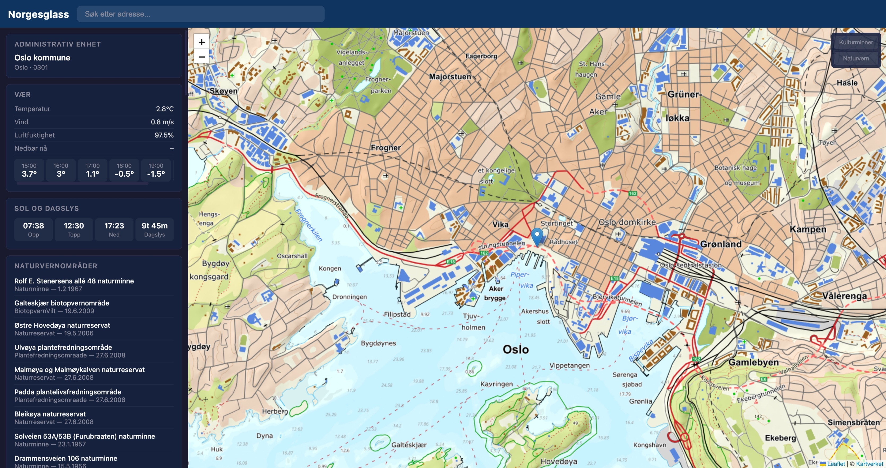

# Norgesglass

A single-page web app that shows everything known about any Norwegian location by querying 16 public APIs simultaneously. Click a point on the map or search an address — panels progressively fill with weather, geology, nature reserves, cultural heritage, demographics, businesses, nearby stores, hydrology, and sunrise data.




## Data panels

| Panel | Source | Data shown |
|-------|--------|------------|
| Administrativ enhet | Kartverket | Kommune, fylke, kommunenummer |
| Vær | MET Norway | Temperature, wind, humidity, precipitation, 6h forecast |
| Sol og dagslys | MET Norway | Sunrise, solar noon, sunset, day length |
| Naturvernområder | Miljødirektoratet | Nearby nature reserves, national parks, protection dates + map overlay |
| Stedsnavn | Kartverket | Place names within 500m |
| Geologi | NGU (via proxy) | Bedrock type, tectonic unit, sediment type |
| Kulturminner | Riksantikvaren | Cultural heritage sites, protection status + map overlay |
| Hydrologi | NVE (via proxy) | Nearby measurement stations |
| Befolkning | SSB | Municipal population (latest year) |
| Virksomheter | Brønnøysundregistrene | Recently founded businesses in municipality |
| Butikker i nærheten | Coop, Norgesgruppen, Narvesen | Nearby grocery/convenience stores sorted by distance |

## Architecture

```
Browser (vanilla JS + Leaflet)
  |
  |-- Direct calls (CORS ok):
  |     Kartverket, MET Norway, Miljodirektoratet,
  |     Riksantikvaren, SSB, Bronnøysund, Coop, Norgesgruppen
  |
  '-- Via Go proxy (:8080):
        /api/ngu      -> NGU WMS (GML -> JSON)
        /api/nve      -> NVE HydAPI (API key injection)
        /api/narvesen -> Narvesen (HTML scrape -> JSON, 24h cache)
```

The Go backend does three things:

1. **NGU proxy** — Translates WMS GetFeatureInfo GML responses into JSON. The NGU geology service only returns XML/HTML, so the server parses the GML and extracts the relevant fields.
2. **NVE proxy** — Injects the `NVE_API_KEY` header so the secret stays server-side.
3. **Narvesen proxy** — Scrapes `narvesen.no/finn-butikk`, extracts store locations from HTML data attributes via regex, and caches the result in-memory for 24 hours. No CORS headers on the source, so a proxy is required.

Everything else is called directly from the browser — no backend needed for Kartverket, MET, SSB, etc.

## Quick start

```bash
# Run directly
go build -o norgesglass .
./norgesglass
# -> http://localhost:8080

# Run with Docker
docker compose up --build
# -> http://localhost:8080
```

### Optional: NVE hydrology data

The hydrology panel requires an API key from [NVE](https://hydapi.nve.no/UserDocumentation/):

```bash
# Direct
NVE_API_KEY=your-key ./norgesglass

# Docker
NVE_API_KEY=your-key docker compose up --build

# Or create a .env file
echo "NVE_API_KEY=your-key" > .env
docker compose up --build
```

Without the key, the hydrology panel shows a message and all other panels work normally.

## Project structure

```
norgesglass/
├── main.go                  # HTTP server, static files, route setup
├── handlers/
│   ├── ngu.go               # NGU WMS proxy + GML parser
│   ├── ngu_test.go          # Unit tests for GML parser + coord validation
│   ├── nve.go               # NVE HydAPI proxy (API key injection)
│   └── narvesen.go          # Narvesen store scraper + 24h cache
├── static/
│   ├── index.html           # SPA shell with 11 panels + map
│   ├── css/style.css        # Dark theme, responsive
│   └── js/
│       ├── api.js           # 15 API fetch functions (pure, no DOM)
│       ├── map.js           # Leaflet init + Kartverket tiles + GeoJSON overlays
│       ├── panels.js        # Panel renderers (XSS-safe)
│       └── app.js           # Orchestration, search, stale-fetch guard
├── Dockerfile               # Multi-stage build (alpine, runs as nobody)
└── compose.yaml
```

## Design decisions

**Zero external Go dependencies.** The NGU GML response is parsed with `encoding/xml` from the standard library. No routers, no frameworks.

**Parallel API calls with stale-fetch protection.** All API calls fire simultaneously when a location is selected. A `fetchId` counter ensures that if the user clicks again before responses arrive, stale results are silently discarded.

**XSS protection.** Every string from an external API passes through an `esc()` function before HTML insertion. Search results use `createElement`/`textContent` instead of `innerHTML`.

**Progressive panel states.** Each panel independently shows loading, error, or empty states. One API being down doesn't affect the others.

**Map overlays.** Kulturminner, Naturvernområder, and nearby stores can be toggled on the map via buttons in the top-right corner. Heritage sites render as amber polygons/markers, nature reserves as green, and stores as blue labeled markers with name, address, and opening hours on hover. Overlays persist across location changes and auto-update with new data.

**No build step.** The frontend is vanilla JS with no transpilation, bundling, or node_modules. Edit a file, refresh the browser.

## Tests

```bash
go test ./handlers/ -v
```

Covers GML parsing (bedrock, sediment, empty response, multiple features) and coordinate validation.

## APIs used

| # | Source | Auth | Via |
|---|--------|------|-----|
| 1 | Kartverket address search | None | Browser |
| 2 | Kartverket admin units | None | Browser |
| 3 | Kartverket place names | None | Browser |
| 4 | Kartverket map tiles | None | Browser |
| 5 | MET Locationforecast | User-Agent | Browser |
| 6 | MET Nowcast | User-Agent | Browser |
| 7 | MET Sunrise | User-Agent | Browser |
| 8 | Miljodirektoratet (ArcGIS) | None | Browser |
| 9 | Riksantikvaren (ArcGIS) | None | Browser |
| 10 | SSB (JSON-stat) | None | Browser |
| 11 | Bronnøysundregistrene | None | Browser |
| 12 | NGU WMS | None | Go proxy |
| 13 | NVE HydAPI | API key | Go proxy |
| 14 | Coop store finder | None | Browser |
| 15 | Norgesgruppen store API | None | Browser |
| 16 | Narvesen store finder | None | Go proxy |

## License

Government data is provided by Norwegian agencies under their respective open data licenses. See [data.norge.no](https://data.norge.no/) for details. Store data is provided by [Coop](https://www.coop.no/), [Norgesgruppen](https://www.norgesgruppen.no/), and [Narvesen](https://www.narvesen.no/) via their public APIs/pages.
